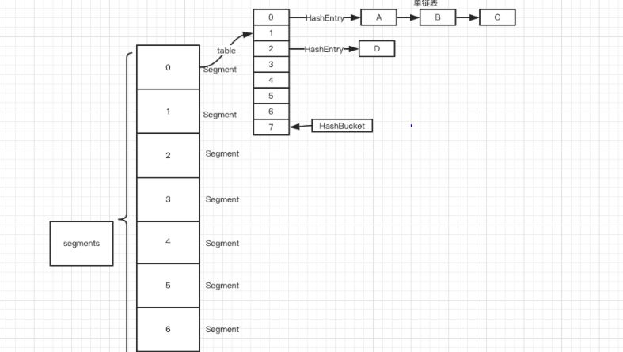

# ConcurrentHashMap 源码分析
  
  - ConcurrentHashMap在jdk1.7中的设计
    
     
       - 每一个segment都是一个HashEntry<K,V>[] table， table中的每一个元素本质上都是一个HashEntry的单向队列,将整个hashmap分成几个小的map，每个segment都是一个锁；与hashtable相比，这么设计的目的是对于put, remove等操作，可以减少并发冲突，对不属于同一个片段的节点可以并发操作，大大提高了性能
       
       
  - ConcurrentHashMap在jdk1.8中的设计   
       - jdk 1.8 取消了基于 Segment 的分段锁思想，直接采用transient volatile HashEntry<K,V>[] table保存数据，采用table数组元素作为锁,改用 CAS + synchronized 控制并发操作，在某些方面提升了性能。并且追随 1.8 版本的 HashMap 底层实现，使用数组+链表+红黑树进行数据存储。
       
         ```
                   final V putVal(K key, V value, boolean onlyIfAbsent) {
                       if (key == null || value == null) throw new NullPointerException();
                       int hash = spread(key.hashCode());
                       int binCount = 0;
                       for (Node<K,V>[] tab = table;;) {
                           Node<K,V> f; int n, i, fh;
                           if (tab == null || (n = tab.length) == 0)
                               tab = initTable();
                           else if ((f = tabAt(tab, i = (n - 1) & hash)) == null) {
                               if (casTabAt(tab, i, null,
                                            new Node<K,V>(hash, key, value, null)))
                                   break;                   // no lock when adding to empty bin
                           }
                           // 如果tab[i]不为空并且hash值为MOVED，说明该链表正在进行transfer操作，返回扩容完成后的table
                           else if ((fh = f.hash) == MOVED)
                               tab = helpTransfer(tab, f);
                           else {
                               V oldVal = null;
                               // 针对通过hash找到的这个节点进行加锁操作，而不是segment，进一步减少线程冲突,单个链表添加元素当然要保证线程安全
                               synchronized (f) {
                                   if (tabAt(tab, i) == f) {
                                       if (fh >= 0) {
                                           binCount = 1;
                                           for (Node<K,V> e = f;; ++binCount) {
                                               K ek;
                                               // 如果在链表中找到值为key的节点e，直接设置e.val = value即可。
                                               if (e.hash == hash &&
                                                   ((ek = e.key) == key ||
                                                    (ek != null && key.equals(ek)))) {
                                                   oldVal = e.val;
                                                   if (!onlyIfAbsent)
                                                       e.val = value;
                                                   break;
                                               }
                                               Node<K,V> pred = e;
                                                // 如果没有找到值为key的节点，直接新建Node并加入链表即可。
                                               if ((e = e.next) == null) {
                                                   pred.next = new Node<K,V>(hash, key,
                                                                             value, null);
                                                   break;
                                               }
                                           }
                                       }
                                         // 如果首节点为TreeBin类型，说明为红黑树结构，执行putTreeVal操作。
                                       else if (f instanceof TreeBin) {
                                           Node<K,V> p;
                                           binCount = 2;
                                           if ((p = ((TreeBin<K,V>)f).putTreeVal(hash, key,
                                                                          value)) != null) {
                                               oldVal = p.val;
                                               if (!onlyIfAbsent)
                                                   p.val = value;
                                           }
                                       }
                                   }
                               }
                               if (binCount != 0) {
                                // 如果节点数>＝8，那么转换链表结构为红黑树结构。 static final int TREEIFY_THRESHOLD = 8;
                                   if (binCount >= TREEIFY_THRESHOLD)
                                       treeifyBin(tab, i);
                                   if (oldVal != null)
                                       return oldVal;
                                   break;
                               }
                           }
                       }
                       addCount(1L, binCount);
                       return null;
                   } 
         ```