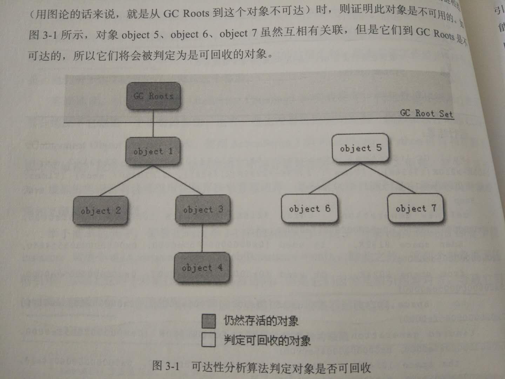
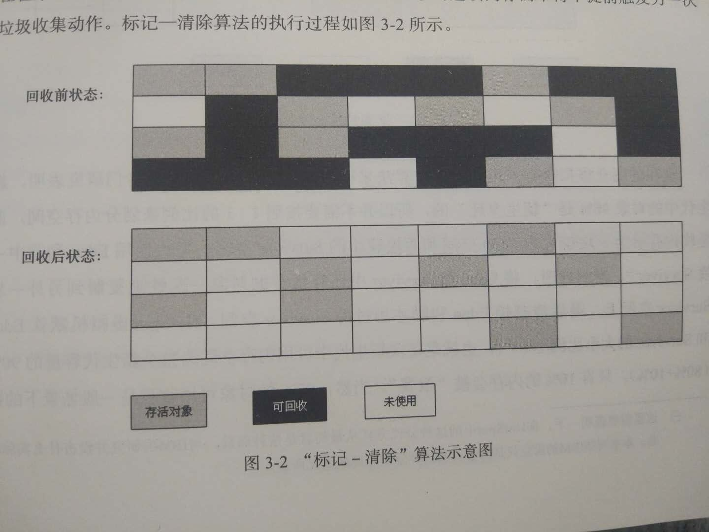
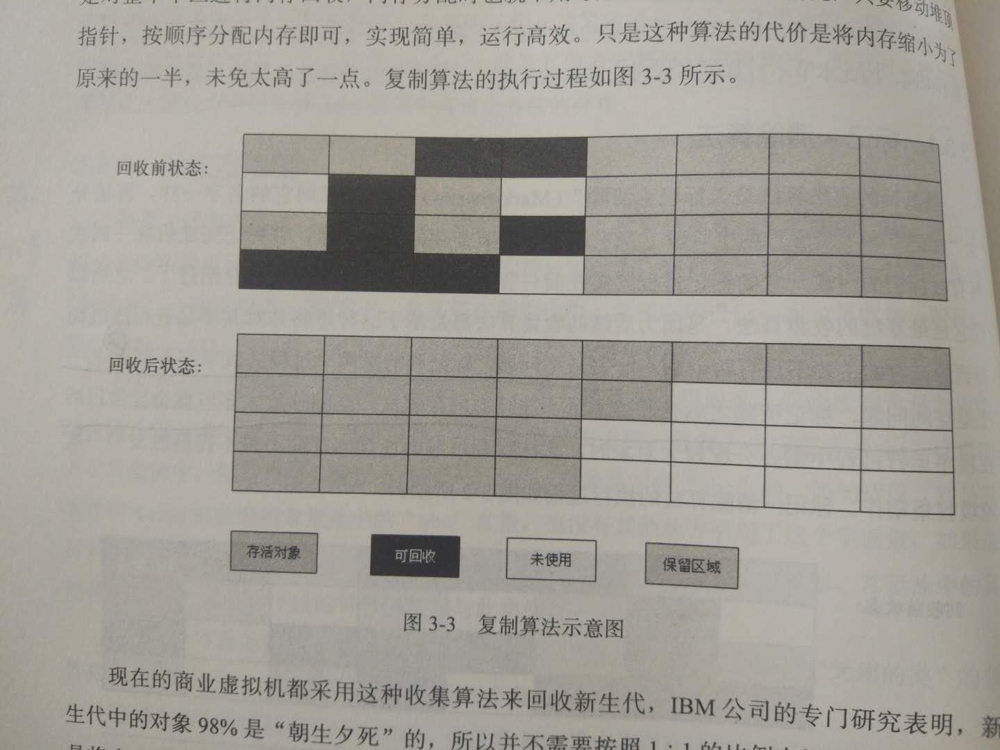
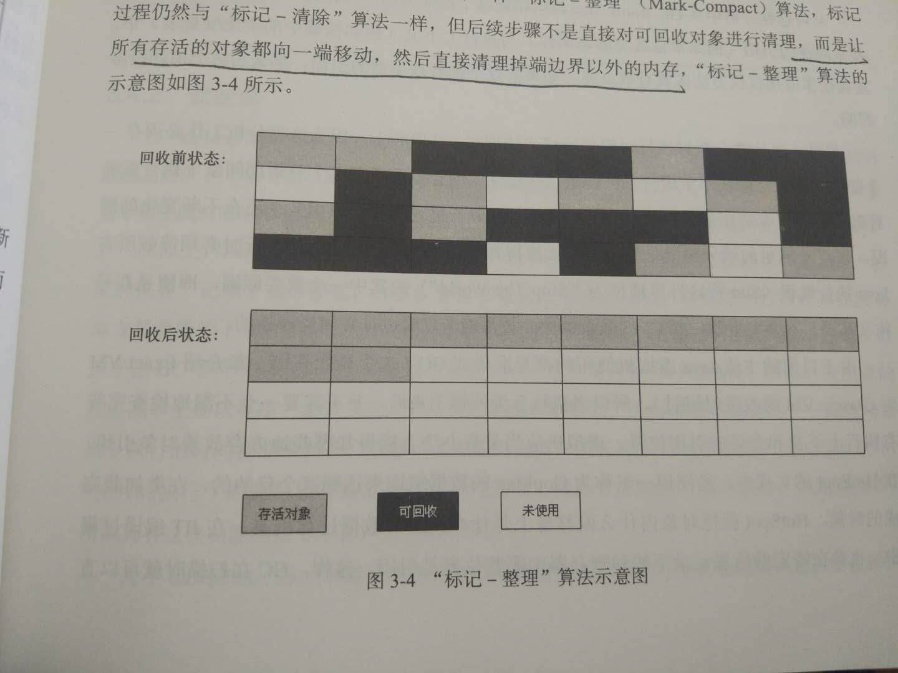

  # java 虚拟机
  -  运行时数据区域
  
       [浏览一下一JAVA内存模型](内存模型.JPG)
       
       [浏览一下一些String字符串在运行时区域的分配情况](String.JPG)
     - 注：线程私有：各个线程之间的计数器互不影响，独立存储。
     - 程序计数器：是一块较小的内存空间，它可以看作是当前线程所执行的字节码的行号指示器,字节码解释器工作时就是通过改变计数器的值来选取下一条需要执行的字节码指令。此内存区域是唯一一个在java虚拟机规范中没有规定任何OutOfMemoryError情况的区域
     - java 虚拟机栈()：每一个方法的执行的同时都会创建一个栈帧用于存储局部变量表/操作数栈/动态链接/方法出口等信息。每一个方法从调用直到执行完成的过程中，就对应着一个栈帧在虚拟机栈中入栈到出栈的过程。
        - 局部变量表：存放了编译器可知的各种基本数据类型（boolean/byte/char/short/int/float/long/double）,对象引用（reference类型，它不等同于对象本身，可能是一个指向对象的起始地址的引用指针，也可以是指向一个代表对象的句柄或者其他与此对象相关的位置）和returnAddress类型（指向了一条字节码指令的地址）
        - 可能抛出：
          - StackOverflowError:请求的栈深度过长；
          - OutOfMemory:扩展无法申请到足够的内存。
     - 本地方法栈:本地方法栈与虚拟机栈所发挥的作用相似。虚拟机栈为虚拟机执行java方法服务，本地方法栈为虚拟机使用到的Native方法服务。
       - 可能抛出：
          - StackOverflowError
          - OutOfMemory
     - java 堆：jav虚拟机所管理的内存中最大的一块，java堆是内存共享的，（不是绝对）对象实例以及数组都要分配到堆上。
        - 扩展：java堆是垃圾收集器管理的主要区域，因此也被称为“GC堆”，现在的收集器基本都是采用分代收集算法，所以java堆中可以细分为：新生代&老年代（后还可细分），堆的采用的垃圾算法后边介绍。
     - 方法区:储存已被虚拟机加载的类信息、常量、静态常量、即使编译器编译后的代码等数据
       - 类信息：如spring使用ioc&aop创建bean时，或者使用cglib反射形成的class信息等。
          - 1 类型的全定名 2 类型的直接超类的全定名 3 类型是类类型还是接口类型 4 类型的访问修饰符
     - 运行时常量：方法区的一部分.类文件除了有类的版本、字段、方法、接口等描述信息外,还有一项是常量池,用于存放编译期生成的各种字面量和符号引用,这部分内容将在类加载后进入方法区的运行时常量池中存放. 此外运行时常量池具备动态性.Java不要求常量一定只有编译期才能产生,运行期间也可能将新的常量放入池中,String的intern()方法就是例子.
             会出现的异常状况:OOM(OutOfMemoryError);
  -  内存溢出&内存泄漏
     - 内存泄漏：一个不再被程序使用的对象或变量还在内存中占有空间。
        ``` Vector v=new Vector(10);
            for(int i=1;i<10;i++){
                Object o=new Object();
                v.add(o);
            }
           //o的作用域将结束，但是由于v在使用这些对象，因此垃圾回收器无法将其收回，造成内存泄漏，只有将这些对象从vector中删除才能释放创建这些对象。解决办法把v设置为null;
        ```
       1. 在堆中申请的空间，没有被释放。
       2. 对象已经不在使用，但仍然在内存中保留着。
       - 内存泄漏的解决方案：
         1. 避免在循环中创建对象
         2. 尽早释放无用的对象引用
         3. 尽量少使用静态变量（静态变量存放在永久代中（方法区中））
         4. 使用字符串处理，避免使用String，应该大量使用StringBuffer，每一个string都得单独占有一块内存空间。
     - 内存溢出：指程序运行过程中，无法申请到足够的内存空间而导致的一种错误。
       - 内存溢出的集中情况，参照上述的jvm的运行时结构。
  -  垃圾回收算
     - 垃圾回收时，关注的内存
       - 有运行时区域的各个部分，我们可以知道程序计数器、虚拟机栈、本地方法栈是线程私有的，3个区域随着线程而生，随线程而死；栈中的栈帧随着方法的进入和退出，有条不紊地执行着出栈和入栈的操作。栈帧中分配多少内存在类结构确定下来了。这几个区域内存不需要过多的考虑回收的问题，方法&线程结束时，内存就自然跟着回收了。
       - Java堆和方法区，由于一个接口中的多个实现类需要的内存可能不一样，一个方法中的多个分支需要的内存也可能不一样，只有在程序的运行时，才知道会创建哪些对象，这部分内存的分配是动态的，这是垃圾收集器主要关注的内容。
     - 垃圾回收前如何判断对象是否存活
       - 引用计数算法
         - 每当有一个地方引用一个对象的时候则在引用计数器上 +1，当失效的时候就 -1，无论什么时候计数器为 0 的时候,对象就是不可能再被引用的，则认为该对象死亡可以回收了。
         - 不能解决循环引用的问题。
       - 可达性分析算法
           - 当一个对象到“GC Roots”没有任何引用链相连，则证明对象是不可用的了。
           -     
     - 垃圾回收的算法
         -    
           - 注:算法分为标记(标记要回收的对象)、清除两个阶段。它的不足之处：1 效率问题：标记和清除的两个过程的效率都不高；2 空间问题：标记清除之后会产生大量不连续的内存碎片。
         -  
           - 为了解决效率的问题而提出来的复制收集算法。
           - 可用内存按容量划分为大小相等的2块，每一次只使用其中的一块，当这一块用完了，就将还存活的对象复制到另一块上面，然后对之前的区域进行全部回收。(牺牲了内存，内存缩小了原来的一半)
           - 现代商业虚拟机采用这种垃圾收集算法来回收新生代。
             - 由于新生代98%是“朝生夕死”，所以将内存划分为 Eden空间和2块较小的Survivor空间（8:1：1），当回收时，将Eden和Survivor中存活者的对象一次性复制到另一个Survivor的空间上，最后清理掉Eden和刚才使用过的Survivor.
         - 
           - 复制算法在对象的存活率较高的时候，会进行较多的复制操作，效率会变低。
           - 根据老年代的特点，提出“标记-整理”算法：前段过程和“标记清除”算法一样，后续不是清除掉标记的对象，而是让存活的对象都向一端移动，然后直接清除掉端边界以外的内存。
         - 分代收集算法
            - 新生代：对象的存活率极低，选用复制算法，只需要付出少量存活对象的复制陈本就可以完成收集。
            - 老年代：对象的存活率极高，没有额外的空间对他进行分配担保，就采用了“标记-清除”&“标记-整理”的算法进行回收。
        
  -  垃圾收集器
  -  类加载的过程访问
     - 加载：通过类的全限定名来获取定义此类的二进制流，此二进制流所代表的静态存储结构转化为方法区的运行时结构，在内存中生成一个代表这个类的java.lang.Class对象，作为方法区这个类的各种数据的访问入口。
     - 验证：确保Class文件的字节流中的信息符合当前虚拟机的要求。
     - 准备：为类变量（static）分配内存并且为其附上零值操作。
     - 解析：虚拟机将常量池内的符号引用替换为直接引用的过程。
     - 初始化：进行构造器初始化。
     - 使用：正式供开发者使用,实例化。
     - 卸载：从JVM中卸载class文件。