# CSS 基础

 * [一、CSS基础语法](#CSS基础语法)
 * [二、CSS使用方法](#CSS使用方法)
 * [三、CSS选择器](#CSS选择器) 
 * [四、CSS继承和层叠](#CSS继承和层叠)
 * [五、CSS优先级](#CSS优先级)
 * [六、CSS命名规范](#CSS命名规范)
 
 ## CSS基础语法
 
  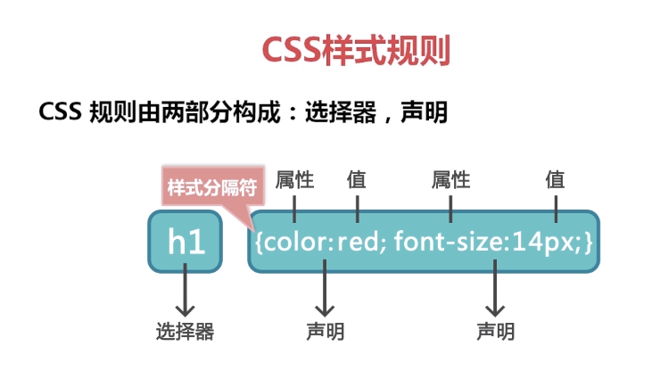
  
## CSS使用方法

> css样式规则

  

> css如何引入样式  
  
  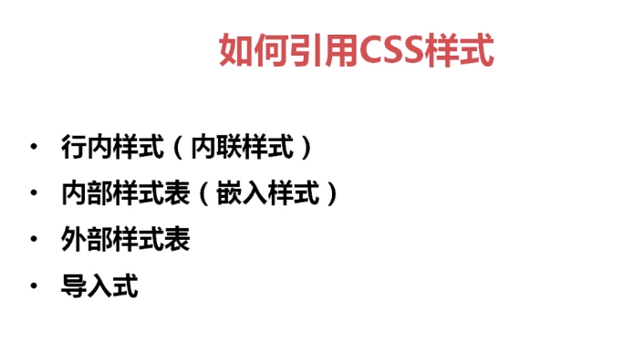
  
> css样式 行内样式 
    
  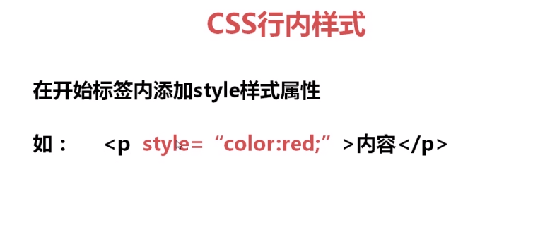
  
> css样式 内部样式
      
  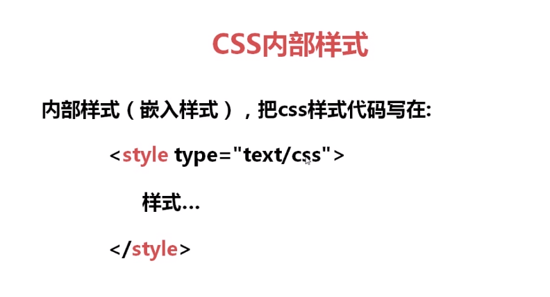
  
> css样式 外部样式
       
  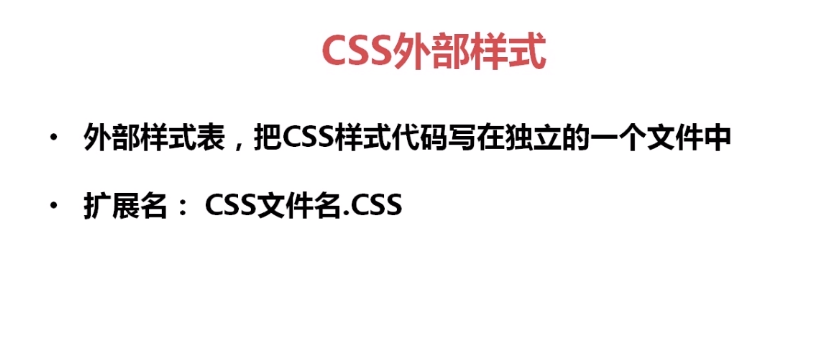  
  
> css样式 导入 

  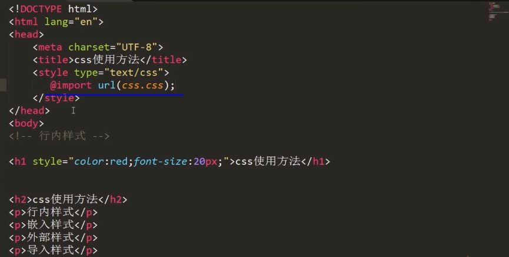 
  
> 区别

  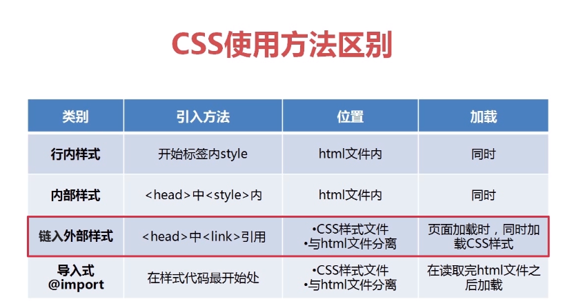 
  
> 推荐

  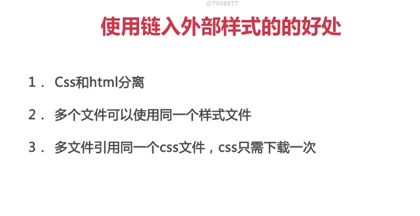 

#   CSS优先级

 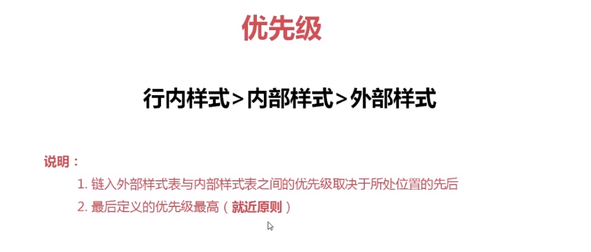 

# CSS选择器

 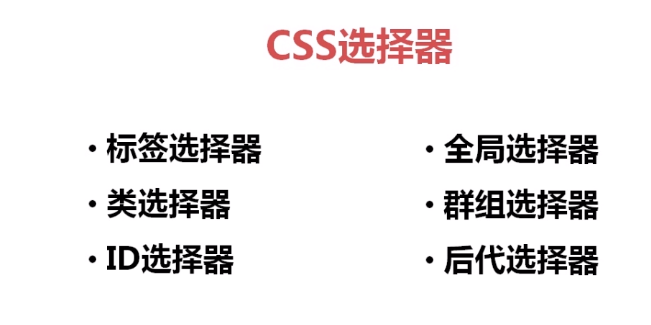 
 
> 标签选择器
 
  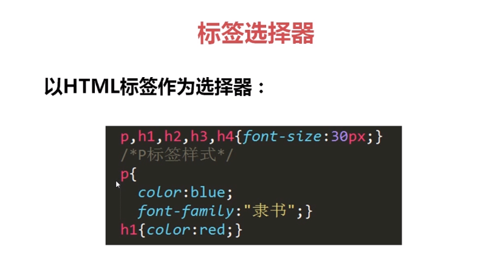 

> 类选择器

 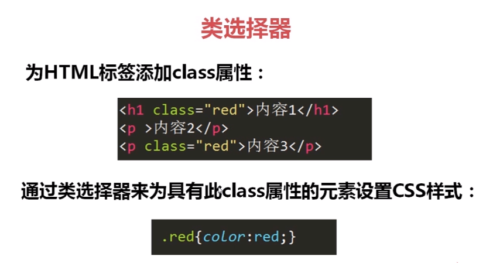 
 
> ID选择器
 
  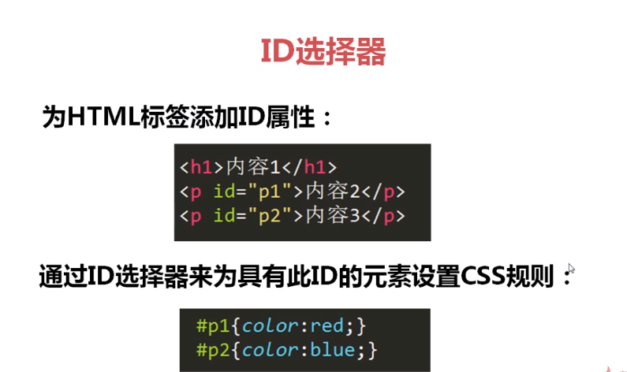 

> 群组选择器

 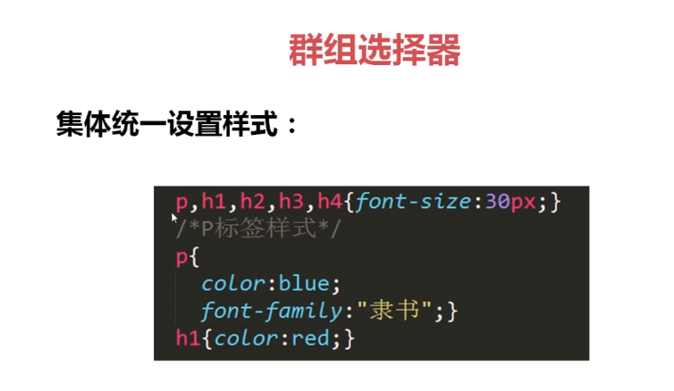 
 
> 全局选择器

 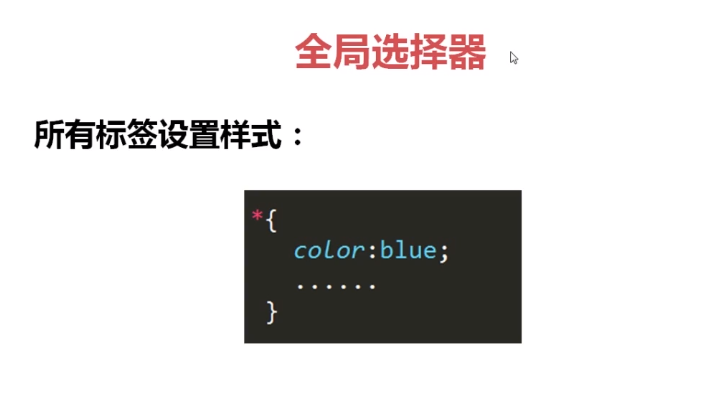 
 
> 后代选择器

 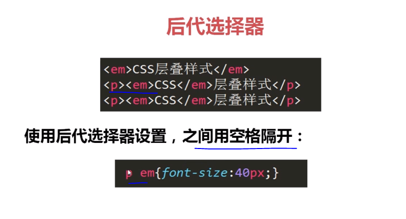 
 
> 伪类选择器

 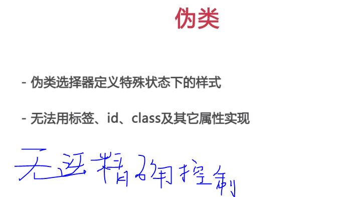 
 
> 链接伪类

 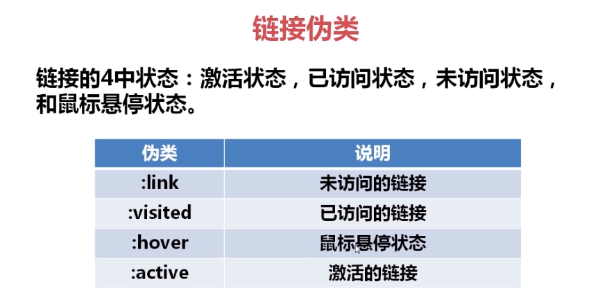 
 
> a :hover&active

 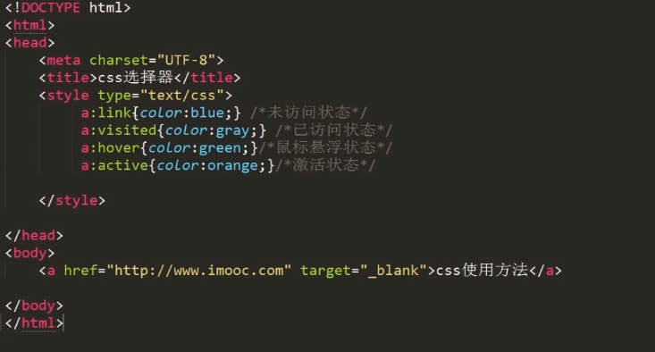   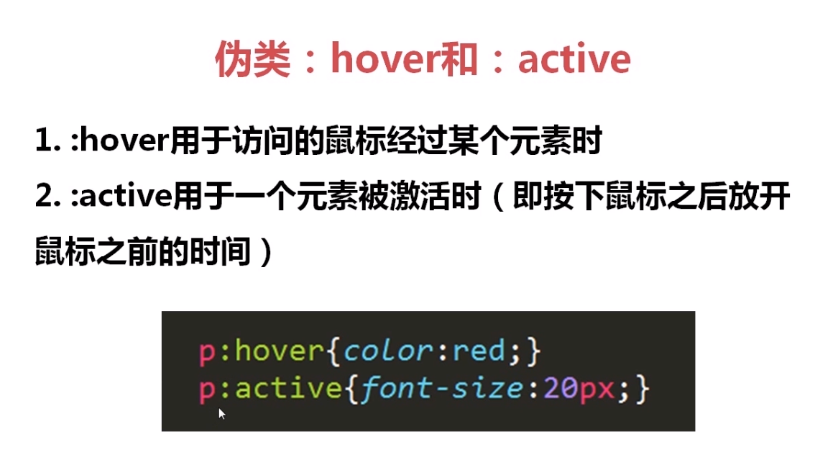 

> 伪类选择器的顺序

 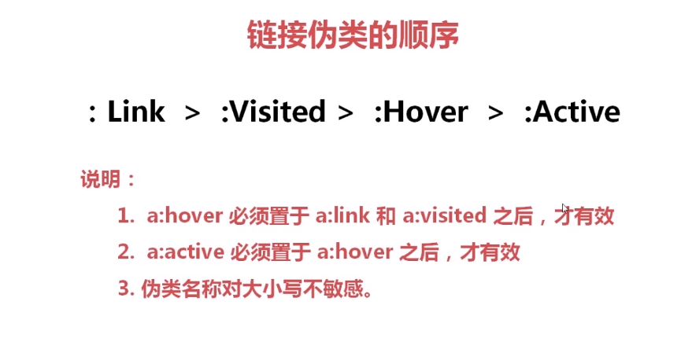
 
 
# CSS继承和层叠

   
 
   

# CSS优先级

 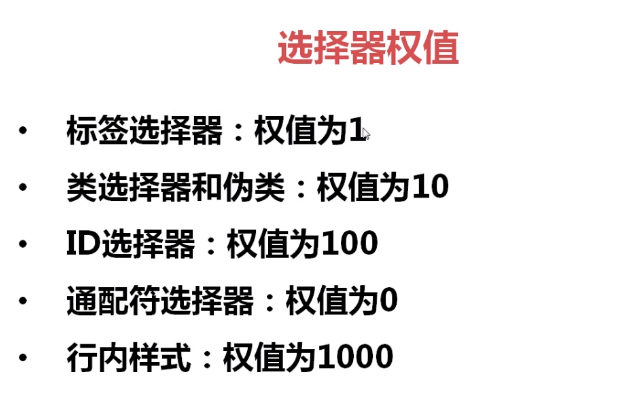 
 
 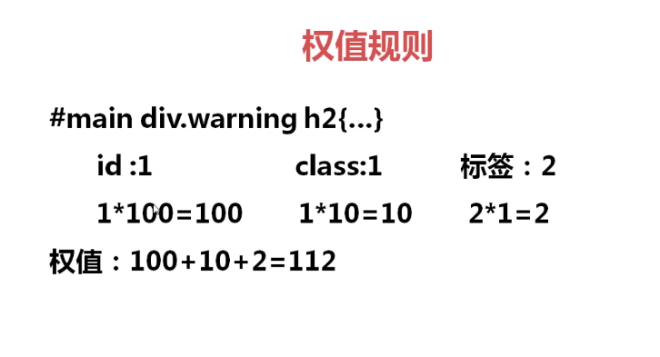 
  
 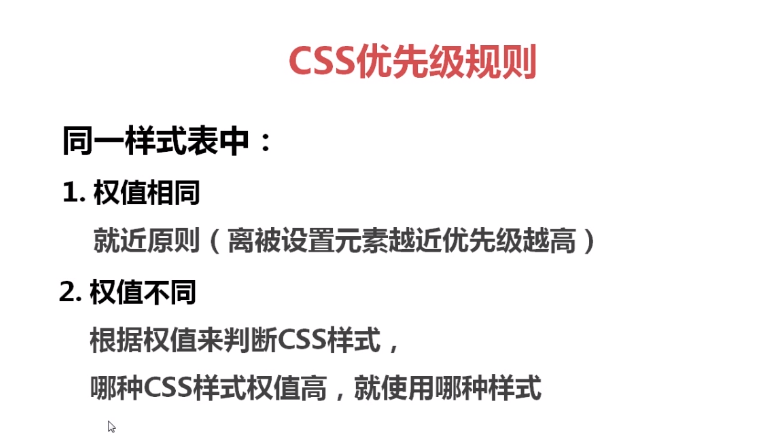 
 
  
