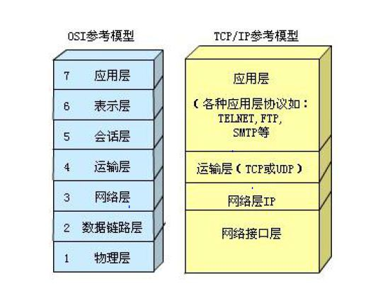
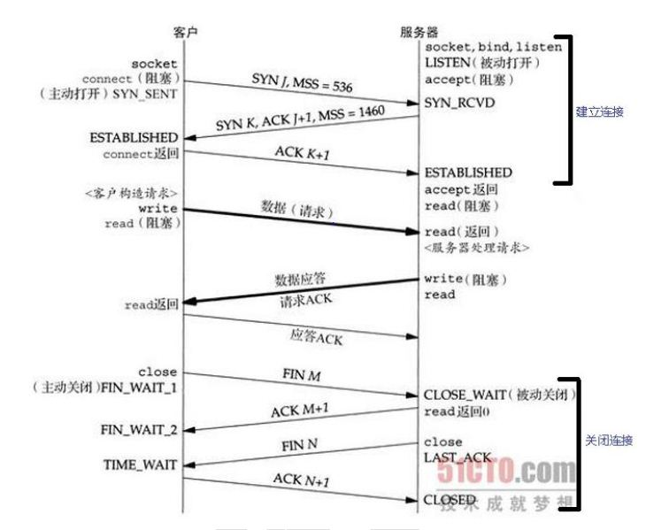
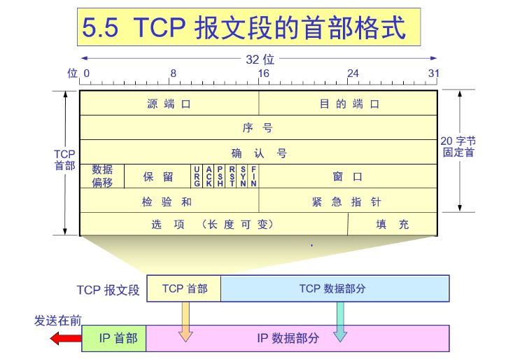
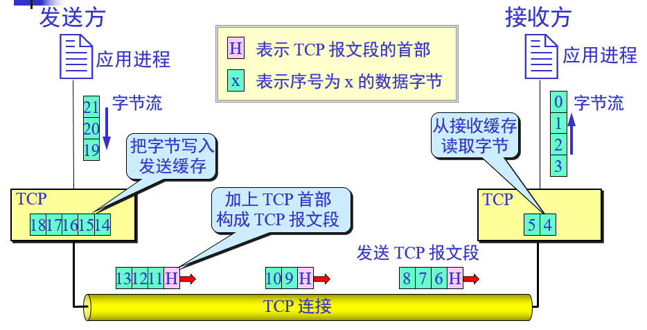
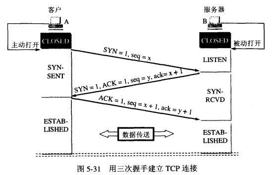
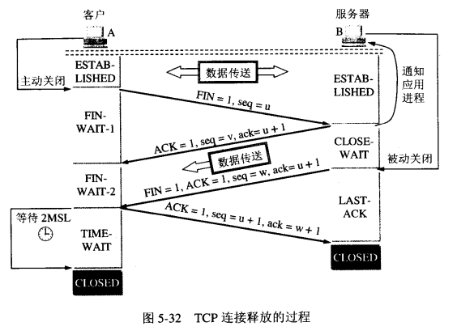

 # 计算机网络
 
 
 - OSI&TCP参考模型
  
  
- TCP & UDP (两个具有代表意义的传输层协议)的区别
  - UDP: 
    - UDP 是无连接的：发送数据之间不需要建立连接，因此减少了开销和发送数据之间的延时。
    - UDP 尽最大努力交付：不保证可靠的交付，因此主机不需要维持复杂的连接状态。
    - UDP 面向报文：应用进程应该选择合适大小的报文，太长、太短都会降低ip层的效率。
    - UDP 没有拥塞控制，保证了应用的实时性。
    - UDP 首部开销小，只有8个字节，比TCP的20个字节的首部要短。
  - TCP:
    - TCP 是面向连接的，应用程序在使用TCP协议前必须先和TCP建立连接，在数据传输完毕时，释放连接。
    - 每一条TCP连接，针对的是点对点的。
    - TCP 提供了可靠的交付服务，TCP连接传送的数据保证无差错、不丢失、不重复、并且是按顺序到达的。
    - TCP 提供了全双工通信：TCP允许通信双方的应用进程在任何时候都能发送数据。TCP连接的两端都设有发送缓存和接收缓存，用来临时存放双向通信的数据。
    - TCP 是面向字节流的：虽然应用程序和TCP的交互是一次一个数据块，但TCP把应用程序交下来的数据看成是一连串的字节流。TCP不保证接收方应用程序所收到的数据块和发送方应用程序所发出的数据块具有对应的大小关系，但是他们的收、发字节流是完全一样的。
 - 三次握手 & 四次挥手..
     - 白话文解释三次握手 ：
         - 第一次握手：一对小情侣，女神A ，屌丝B ，女神A看屌丝B虽屌丝，但是屌丝B淳朴老实，有意与他交往，于是前往搭讪，
         - 第二次握手：当屌丝B把手给心目中的女生A ，告诉A ，晚上嘿嘿嘿，
         - 第三次握手：女神A 腼腆一笑，把自己的手给B，两人相视一笑。
     - 白话文解释四次挥手 ：
         - 第一次挥手：还是之前的小情侣，女神A 终于发现屌丝B 太丑了，要和他分手，
         - 第二次挥手：屌丝B 已经知道自己配不上A ，也同意A 的分手请求，同时也对A说出了同意分手的话，这时候还没分呢，     
         - 第三次挥手：屌丝B 吧之前女生送给他的东西，全还了，并且说了，以后再也不见面，然后放开了A 的小手，
         - 第四次挥手: 女神A看到B 都把东西还给他了，也放下了B的小手，真的就分开了。
     - 交互图
          
        
        
   - 
     - 源端口和目的端口字段(2个字节)：端口是运输层与应用层的服务接口。运输层的复用和分用功能都要通过端口才能实现。
     - 序号字段(4字节)：TCP传送是一个一个字节来传送，所以TCP连接传送的数据流中的一个字节都编上了一个序列号，序号字段的值指的是本段所发送的数据的第一个字节的序号。
     - 确认号(4字节)：是期望收到对方的下一个报文段的数据的第一个字节序号。若确认号为N,表示序号N-1为止的所有数据都已经收到。
     - 数据偏移(即首部的长度)：以4B为单位，由于首部最大为60B,所以此数值最大为15.
     - 保留字段(6比特)：保留为今后使用，但目前的值为0，该字段可以忽略不计。
     - 紧急位URG:URG=1,表明是紧急位。
     - 确认位ACK:只有当ACK=1时，确认号字段才有效，ACK=0,确认号无效。TCP规定，在建立连接后，所有传送的报文段都必须把ACK设置为1.
     - 推送位PSH:接收到PSH=1的报文段，就尽快交付给应用进程，不再等到整个缓存都填满了再交付上去。
     - 复位位RST:PST=1,表明TCP连接中出现严重的错误，必须释放连接，然后再建立新的运输连接。
     - 同步位SYN:同步SYN=1，表明是一个连接请求或连接接收报文。
     - 当SYN=1,ACK=0时，表明这是一个连接请求报文，如果对方同意连接，则响应文中使用当SYN=1,ACK=1
     - 终止位FIN:用来释放一个连接，FIN=1,表明此报文段的发送方的数据已经发送完毕，并且要求释放连接。
       
       
       
     - 为什么要三次握手
       - 防止已经失效的连接请求报文段突然又传到了服务端。服务端一直等待，资源浪费
        [为什么要三次握手.JPG](为什么要三次握手.JPG)
     - 为什么要四次挥手
       - 确保数据能够完整传输，例如客户端想关闭连接,但服务端此时可能还有数据发送,因此服务端先发送一个ACK报文回复客户端的关闭请求, 当服务端数据发送完毕后,此时在发送一个FIN报文,而客户端接收到服务端FIN报文后,才正式确认双方都没有数据发送,连接才最终关闭。
 
   ## HTTP协议(TCP的长连接&短连接的实际应用)
   
   ## 什么是HTTP
     
   HTTP（超文本传输协议）是一个客户端和服务器的请求和响应的标准的TCP,它是建立在TCP之上的。
   
   ## 一次HTTP操作称为一次事务
   
   |其工作的流程|
   | :--------  |
   |1 客户端与服务器需要建立连接|
   |2 建立连接后，客户端发送请求|
   |3 服务端响应请求|
   |4 客户端接收到服务端返回的信息通过浏览器显示在用户的显示频上，断开连接|
   
   ## HTTP 报文
   
   |请求报文的格式|
   | :--------  |
   |1 请求行  ：方法字段+url+Http版本协议|
   |2 通用信息头 ：|
   |3 请求头|
   |4 实体头|
   |5 空行|
   |6 报文主体 ：请求主体少不了请求参数|
   
   
   |应答报文的格式|
   | :--------  |
   |1 HTTP协议版本+状态码+状态代码的文本描述|
   |2 通用信息头 ：|
   |3 响应头：处理请求的原始服务器的软件信息|
   |4 实体头：接收方实体的介质类型（报文主体是什么）|
   |5 空行|
   |6 报文主体 ：HTML的响应页面|
   
   ## 状态码
   
   |响应行-状态码|
   | :--------  |
   |1 1xx:请求已接受，继续处理|
   |2 2xx:成功|
   |3 3xx:重定向|
   |4 4xx:客户端错误|
   |5 5xx:服务端错误|
   
   200：请求成功。
   
   304：Not Modified:未按预期修改的文档。客户端缓存的文档并发出一个条件性的请求。服务端告诉客户，原来缓存的文档还可以继续使用。
   
    
   
   