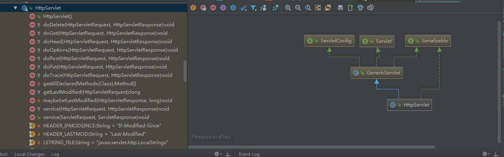
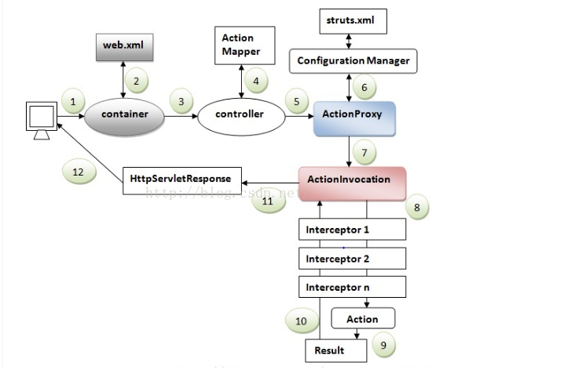
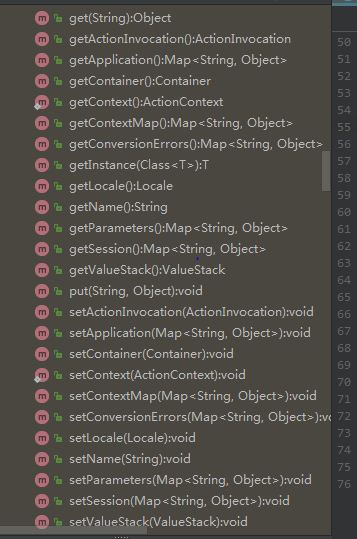
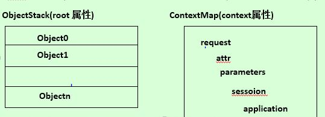
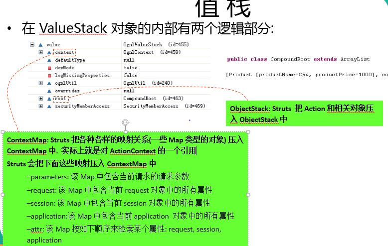
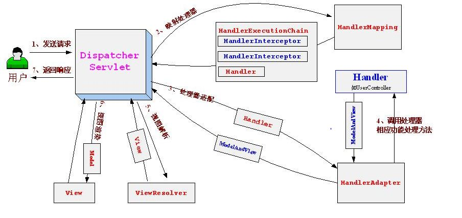

# j2ee解读

 - session&cookie
 
   - 由于Http是无状态的，服务器单从网络无法知道客户的身份，就给了客户端们颁发了一个通行证，这样服务端将可以通过通行证确定用户的身份了，这就是Cookie的工作原理。
   - Session是保存在服务器上的，客户端在次访问的时候，只需要在该Session中查找客户的状态就可以了。
  
    |session&cookie区别||
    | :--------  | :--------  |
    |session是在服务器端保存用户信息|cookie是在客户端保存用户的信息|
    |session对象随会话的结束而关闭|cookie是长期保存在客户端的|
    |session通常保存重要的信息|cookie通常保存不重要的信息|
    |Sesion存储的是对象相对是比较方便的，但是Session存储在服务器内是会对服务器造成压力的|Cookie对象保存的是一个属性对，一个request&response可以同时使用多个Cookie|   
    |Session第一次访问服务器的时候会自动创建，Session超时的时间可以在web.xml配置文件中修改<session-config><sessiom-timeout>60</session-timeout></session-config>单位为分钟|关闭浏览器的时候，Cookie就会消失，Cookie上默认的的maxAge是-1，maxAge为负数的时候，为临时性的Cookie,不会写到Cookie文件中，maxAge为0的时候，表示删除Cookie&也可以选择response.add(Cookie cookie)同名时覆盖原有的|
     
      - cookie是由服务器生成的，发送给客户端浏览器的，浏览器会将其保存在某个目录下的文本文件 
        
 - jsp&servlet
 
  - jsp
  
    - 什么是jsp:是一种动态的网页技术，jsp就是指在html中嵌套了java的脚本语言。
    - 工作原理：在web服务器接收到了jsp请求时，首先会对jsp文件进行翻译，将编写好的jsp文件通过jsp引擎转化成可识别的java源代码，java源代码再被编译成可执行的字节码文件（.class）,编译后进入执行阶段，将结果页面返回给客户端。
    - jsp九大内置对象
    
      |内置对象|描述|
      | :--------  | :--------  |
      |pageContext|jsp的页面容器|
      |request|得到用户的请求信息|
      |response|服务器向客户端返回的信息|
      |session|用来保存一个用户的信息|
      |application|表示所有用户的共享信息|
      |config|服务器配置，获取初始化参数|
      |out|页面输出|
      |page|表示从页面中表示出来的一个Servlet实例|
      |exception|表示jsp页面所发生的异常，在错误页面中才起作用|
    
    - 4中属性的范围
    
       |||
       | :--------  | :--------  |
       |page|只在一个页面中保存属性，跳转之后无效|
       |request|只在第一次请求中保存属性，服务器跳转之后依然有效|
       |session|在一次会话的范围中保存，无论何种跳转都可以使用，但是新打开浏览器无法使用|
       |application|在整个服务器上保存，所有用户都可以使用|
      
    - 客户端跳转&服务端跳转
      
       |客户端跳转|服务端跳转|
       | :--------  | :--------  |
       |response.sendRedirect()|<jsp:forward>|
       |跳转之后地址栏是会改变的，变为跳转之后页面的地址|跳转之后地址栏是不会改变的|
       
         - 在使用request时，只有在服务器端的跳转才能够保存request范围的属性保存到跳转页面，而如果是客户端的跳转，则无法保存request属性的传递。
       
  - servlet
    - 什么是servlet:Server+Applet(web环境下，运行于客户端的java组件),-->运行于服务端的java程序。servlet是特殊的java类并提供基于请求-响应模式的web服务，他没有main()方法，他不能独立运行，他是运行于容器中的。
    - 处理流程：浏览器中输入一串url地址，servlet容器通过url地址，通过web.xml配置文件找到对应的servlet,同时将请求转给servlet对应的service方法，（每当一个客户端请求一个HttpServlet对象的时候，该对象的service方法就会被调用，而且传递给这个方法一个HttpServletRequest对象&HttpServletResponse对象作为参数）,当时get请求的时候，service将请求转给doGet(),方法处理，当post请求的时候，则转给doPost()，方法处理。最后都是通过HttpServletResponse将响应结果返回给客户端。
   
      | servlet的生命周期 |
      | :--------  | 
      | 1： 构造器：只有第一次请求servlet时，创建servlet的实例，调用构造器，这说明servlet是一个单实例  | 
      | 2： init方法：只被调用一次，在创建好实例后立即被调用，用于初始化servlet（包含参数，初始化是构造器所不及的）|
      | 3： service方法：每一次的请求都会被调用，实际用于响应请求 |
      | 4： destroy方法：只被调用一次，在servlet所在的Web应用被卸载前被调用，用于释放当前servlet所占的资源 |
 
    - public void init(ServletConfig servletConfig)
       ```
         servletConfig 1封装了servlet的配置信息
                       2可获取servletContext对象 getServletContext()
            1.getInitParameter(String name):获取初始化参数
            2.getInitParameterNames():获取参数名组成的Enumeration对象
            3.getServletName()：获取<Servlet-name>文本内容
            
       ```
    - Servlet API
       - HttpServlet:能够根据客户端发过来的请求，进行相对应的处理，并且将处理的结果会自动分装到HttpServletRequest对象中，根据HTTP协议中的定义的请求方法，HttpServlet分别提供了请求的相对应的方法。
       
       
       - ServletContext:是servlet中的全局存储信息，当服务器启动的时候，web容器为web应用创建了唯一的ServletContext对象，可以在ServletContext中存放共享信息。
         - ServletContext（即application）是由ServletContextListener接口监听的，他能监听ServletContext对象的生命周期，实际上就是监听web应用的生命周期，Servlet容器终止或者启动Web应用时候，会触发ServletContextEvent事件，ServletContextListener接口中定义了处理事件的两种方法。
         
            -  contextInitialized(ServletContextEvent sce) ：当Servlet 容器启动Web 应用时调用该方法。在调用完该方法之后，容器再对Filter 初始化，并且对那些在Web 应用启动时就需要被初始化的Servlet 进行初始化。
            -  contextDestroyed(ServletContextEvent sce) ：当Servlet 容器终止Web 应用时调用该方法。在调用该方法之前，容器会先销毁所有的Servlet 和Filter 过滤器。
            
             ```
               //实际开发中的应用，启动tomcat时候，将Spring容器中取出数据放入application中
               @Component
               public class InitAction implements ServletContextListener,ApplicationContextAware{
               
               	private static ApplicationContext applicationContext;
               	
               	@Override
               	public void contextDestroyed(ServletContextEvent arg0) {
               		// TODO Auto-generated method stub
               		
               	}
               
               	@Override
               	public void contextInitialized(ServletContextEvent servletContextEvent) {
               		// 获取application
               		ServletContext application=servletContextEvent.getServletContext();
               		//Spring容器中取出相关bean的值
               		ProductBigTypeService productBigTypeService=(ProductBigTypeService)applicationContext.getBean("productBigTypeService");
               		List<ProductBigType> bigTypeList=productBigTypeService.findAllBigTypeList();
               		//数据存放于application中，贯穿web应用的整个生命周期
               		application.setAttribute("bigTypeList", bigTypeList);
               	}
               
               	@Override
               	public void setApplicationContext(ApplicationContext applicationContext)
               			throws BeansException {
               		// TODO Auto-generated method stub
               		this.applicationContext=applicationContext;
               	}
               
               }

             ```
       
 - 表现层框架（Struts2&SpringMvc）
    
   - Struts2
     
     
     
      |Struts2的工作流程|
      | :--------  | 
      |1 客户端提交一个HttpServletRequest请求|
      |2 请求被提交到了一系列的过滤器(Filter),其中FilterDispatcher是核心控制器|
      |3 FilterDispatcher询问ActionMapper是否需要调用某个Action来处理这个请求，如果决定要处理这个请求，FilterDispatcher则把请求的处理交给了ActionProxy|
      |4 ActionProxy通过询问配置文件，找到调用的Action类|
      |5 ActionProxy创建了一个ActionInvocation实例，同时Actionproxy通过代理模式调用Action,在调用之前，ActionInvocation会根据配置加载Action相关的拦截器(Interceptor)|
      |6 Action执行完毕后，ActionInvocation负责根据配置文件的配置找到对应的返回结果result|
      
   - Struts2几个重要的API
     
     - ActionContext:是Action的上下文对象，Action运行期间所用到的数据都会保存到ActionContext中
      
      
      
        - 获取request比较奇葩：public Object get(Object key): ActionContext 类中没有提供类似 getRequest() 这样的方法来获取 HttpServletRequest 对应的 Map 对象. 要得到 HttpServletRequest 对应的 Map 对象, 可以通过为 get() 方法传递 “request” 参数实现

        - 一般开发中的用法
      
        ```  public String findByBId(){
                  Brand brand=phonesizeService.findByPsid(psid);
                  //存于session中
                   ActionContext.getContext().getSession().put("brand",brand);
                   PageBean<Phone> pageBean= phoneService.findByPageBid(psid,page);
                   //存于值栈中
                   ActionContext.getContext().getValueStack().set("pageBean",pageBean);
                   return "findByBId";
               }

        ```
       - 值栈的理解：ValueStack(值栈): 贯穿整个 Action 的生命周期(每个 Action 类的对象实例都拥有一个 ValueStack 对象). 相当于一个数据的中转站. 在其中保存当前 Action 对象和其他相关对象. 
       
          & 
      
        ```   
             //存在值栈时候怎么在jsp页面进行的访问
             <s:if test="pageBean!=null">
                       第<s:property value="pageBean.page"/>/<s:property value="pageBean.totalPage"/>页
                       <s:if test="pageBean.page!=1">
                           <a href="${pageContext.request.contextPath}/phone_findByBId.action?psid=<s:property value="psid" />&pageBean.page=1">首页</a>
                           <a href="${pageContext.request.contextPath}/phone_findByBId.action?psid=<s:property value="psid" />&page=<s:property value="pageBean.page-1" />">上一页</a>
                       </s:if>
                       <s:iterator var="i" begin="1" end="pageBean.totalPage">
                           <s:if test="pageBean.page!=#i">
                               <a href="${pageContext.request.contextPath}/phone_findByBId.action?psid=<s:property value="psid" />&page=<s:property value="#i" />"><s:property
                                       value="#i"/></a>
                           </s:if>
                           <s:else>
                               <s:property value="#i"></s:property>
                           </s:else>
                       </s:iterator>
                       <s:if test="pageBean.page!=pageBean.totalPage">
                           <a href="${pageContext.request.contextPath}/phone_findByBId.action?psid=<s:property value="psid" />&page=<s:property value="pageBean.page+1" />">下一页</a>
                           <a href="${pageContext.request.contextPath}/phone_findByBId.action?psid=<s:property value="psid" />&page=<s:property value="pageBean.totalPage" />">尾页</a>
                       </s:if>
                   </s:if>

        ```
        ```
           //存在session时候怎么在jsp页面进行的访问
           <s:iterator value="#session.blist" var="b">
                            <a href="${pageContext.request.contextPath}/phone_findByBId.action?psid=<s:property value="#b.bid" />&page=1">
                                <li><span><s:property value="#b.bname"></s:property>
        
                            </span></li>
                            </a>
            </s:iterator>

        ```
   - SpringMvc
  
     
    
      | SpringMvc体系结构|
      | :--------  | 
      |1 客户端发送了一个HTTP请求|
      |2 DispatcherServlet接收到请求之后，将请求的处理工作委托给具体的处理器(Handler)-->处理请求相应的业务逻辑，Dispatcher凭借请求信息（url），按照某种机制找到了请求对应的处理器，DispatcherServlet通过HandlerMapping完成这一工作|
      |3 一个设计良好的处理器应该通过调用service层的业务对象完成业务处理|
      |4 处理器完成业务逻辑的处理后，返回了一个ModelAndView给DispatcherServlet,他包含了视图的逻辑名和渲染视图时，需要用到的模型对象。|
      |5 ModelAndView包含了视图逻辑名，DispatcherServlet必须知道逻辑名对应的真实视图对象，视图的解析工作由ViewResolver来完成|
      |6 得到真实的视图对象后，DispatcherServlet将请求分派给View对象，由他完成Model数据的渲染工作|
      |7 最终客户端得到返回的响应|
   
 - 持久化框架（Mybatis&Hibernate） 
  
   - Mybatis入门可见另一个仓库：https://github.com/wby95/mybatis_helloworld
 
 - Spring
 
    
   - | Spring 是一个容器, 因为它包含并且管理应用对象的生命周期. |
     | :--------  | 
     | 1. ApplicationContext ctx=new ClassPathXmlApplicationContext("applicationContext.xml");创建spring的ioc容器(容器初始化bean) |
     | 2. HelloWorld helloworld=(HelloWorld)ctx.getBean("applicationContext.xml所设置的id值");容器中取出bean实例 |
     | 3. helloworld.methods()//调用方法 |


   - |BeanFactory和ApplicationContext的区别|
     | :--------  |  
     | 1. BeanFactory是解析，管理，实例化所有容器的Bean的入口|
 	 | 2. ApplicationContext继承自BeanFactory，提供了国际化，统一的资源文件读取方式等扩展|
 	 | 3. BeanFactory在启动的时候不会实例化Bean，getBean()的时候才会实例化。ApplicationContext在解析配置文件时会对配置文件所有对象都初始化。|
 	 | 4. ConfigurableApplicationContext 扩展于 ApplicationContext，新增加两个主要方法：refresh() 和 close()， 让 ApplicationContext 具有启动、刷新和关闭上下文的能力|
     | 5. ApplicationContext 的主要实现类：- ClassPathXmlApplicationContext：从 类路径下加载配置文件- FileSystemXmlApplicationContext: 从文件系统中加载配置文件|

        
   - IOC(Inversion of Control)：其思想是反转资源获取的方向. 传统的资源查找方式要求组件向容器发起请求查找资源. 作为回应, 容器适时的返回资源. 而应用了 IOC 之后, 则是容器主动地将资源推送给它所管理的组件, 组件所要做的仅是选择一种合适的方式来接受资源. 
      DI(Dependency Injection) — IOC 的另一种表述方式：即组件以一些预先定义好的方式(例如: setter 方法)接受来自如容器的资源注入. 
   - 自动装配
      1. no – 缺省情况下，自动配置是通过“ref”属性手动设定
      2. byName – 根据属性名称自动装配。如果一个bean的名称和其他bean属性的名称是一样的，将会自装配它。
        ```
         <bean id="address" class="com.hebeu.model.Address">     
           <property name="fulladdress" value="YiLong Road, CA 188"></property>  
         </bean> 
         //fulladdress是Address类的属性
        ```
      3. byType – 按数据类型自动装配。如果一个bean的数据类型是用其它bean属性的数据类型，兼容并自动装配它。  
      4. constructor – 寻找有相同构造参数的Bean进行装配
      5. autodetect – 先尝试以constructor的方法进行装配，失败后byType进行装配【在Spring3.0以后的版本被废弃，已经不再合法了】
   - Bean的作用域
     
   - Spring Bean的生命周期
   
     - 没配置后置处理器前
   
       | Spring IOC 容器对 Bean 的生命周期进行管理的过程|
       | :--------  | 
       | 1. 通过构造器或工厂方法创建 Bean 实例|
       | 2. 为 Bean 的属性设置值和对其他 Bean 的引用|
       | 3. 调用 Bean 的初始化方法|
       | 4. Bean 可以使用了|
       | 5. 当容器关闭时, 调用 Bean 的销毁方法|
           
     
     - 配置后置处理器后
     
       |Spring IOC 容器对 Bean 的生命周期进行管理的过程|
       | :--------  | 
       | 1. 根据一定的策略实例化Bean并且注入|
       | 2. 如果这个Bean实现了BeanNameAware接口，setBeanName()|
       | 3. 如果这个Bean实现了BeanFactoryAware接口，setBeanFactory()|
       | 4.	如果这个Bean实现了BeanPostProcessor接口，postProcessBeforeInitialization()|
       | 5. 如果这个Bean配置了init-method或者实现了InitializingBean接口，就初始化Bean|
       | 6. 如果这个Bean实现了BeanPostProcessor接口，postProcessAfterInitialization()|
       | 7. 如果配置了destroy-method或者实现了DisposableBean接口，会销毁Bean|
       
              

   - |Spring AOP中的概念|
     | :--------  | 
     |目标(Target): 被通知的对象|
     |增强处理（Advice）：就是你想要的功能|
     |通知(Advice):  切面必须要完成的工作|
     |切入点（PointCut）：准备进行增强处理的连接点|
     |连接点（Joinpoint）：可以进行增强处理的地方,程序执行的某个特定位置：如类某个方法调用前、调用后、方法抛出异常后等。连接点由两个信息确定：方法表示的程序执行点；相对点表示的方位。例如 ArithmethicCalculator#add() 方法执行前的连接点，执行点为 ArithmethicCalculator#add()； 方位为该方法执行前的位置|
     |切点（pointcut）：每个类都拥有多个连接点：例如 ArithmethicCalculator 的所有方法实际上都是连接点，即连接点是程序类中客观存在的事务。AOP 通过切点定位到特定的连接点。类比：连接点相当于数据库中的记录，切点相当于查询条件。切点和连接点不是一对一的关系，一个切点匹配多个连接点，切点通过 org.springframework.aop.Pointcut 接口进行描述，它使用类和方法作为连接点的查询条件。|
     |切面（Aspect）：Advice+PointCut横切关注点(跨越应用程序多个模块的功能)被模块化的特殊对象|
     |引入（Introduction）：允许我们向现有的类添加新方法属性|
     |织入（Weaving）：把切面应用到目标对象来创建新的代理的过程|
     
         
    - 事物的传播性行为   
    
         
       
       
       
      
   -----------------------------------------------------
   
   ##### spring部分知识点引用尚硅谷的教程
