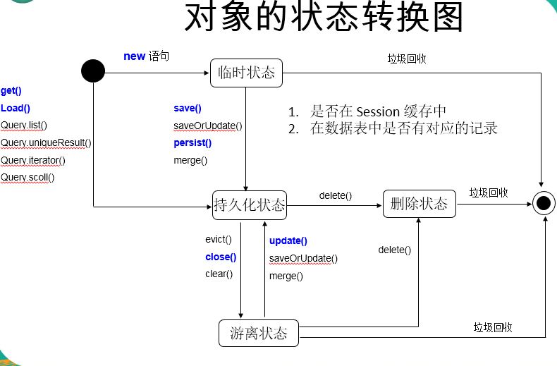

# hibernate

 # hibernate 五个核心接口 对持久化对象的CRUD&事务的控制
 
 |Session|SessionFactory|Transaction|Query|Configuration|
 | :--------   | :--------  | :--------  |  :--------  |  :--------  | 
 |负责执行被持久化对象的CRUD操作（与数据库交互），非线程安全|负责初始化hibernate,充当数据存储源的代理，并负责创建session,一个项目通常只需要一个SessionFactory(多数据库时候，每一个数据库指定一个SessionFactory)|Transaction负责事务的相关的操作|Query&Criteria接口负责执行各种数据库的查询，可以使用HQL,SQL两种表达方式|Configuration接口负责配置并且启动hibernate，创建SessionFactory对象|
 
 # 创建Configuration
 
  Xml文件（hibernate.cfg.xml）
  
  Configuration cfg = new Configuration().configure();

# 构建SessionFactory
  
  
  针对单个数据库映射关系经过编译后的内存镜像，是线程安全的。
   
  SessionFactory 对象一旦构造完毕，即被赋予特定的配置信息
  
  SessionFactory是生成Session的工厂
  
  构造 SessionFactory 很消耗资源，一般情况下一个应用中只初始化一个 SessionFactory 对象。
  
  Hibernate4 新增了一个 ServiceRegistry 接口，所有基于 Hibernate 的配置或者服务都必须统一向这个 ServiceRegistry  注册后才能生效
  
 
   |  Hibernate4 中创建 SessionFactory 的步骤  |
   | :--------   |
   | Configuration configuration = new Configuration().configure();  //创建configuration 对象|
   | ServiceRegistry serviceRegistry=new ServiceRegistryBuilder().applySettings(configuration.getProperties()).buildServiceRegistry(); //创建 serviceRegistry对象|
   | SessionFactory sessionFactory=configuration.buildSessionFactory(serviceRegistry)|

 
 # SessionFactory负责初始化hibernate,充当数据存储源的代理,整合可以这样写
 
 ```
 	<!-- 配置 C3P0 数据源 -->
 	<bean id="dataSource" class="com.mchange.v2.c3p0.ComboPooledDataSource">
 		<property name="user" value="${jdbc.user}"></property>
 		<property name="password" value="${jdbc.password}"></property>
 		<property name="driverClass" value="${jdbc.driverClass}"></property>
 		<property name="jdbcUrl" value="${jdbc.jdbcUrl}"></property>
 	</bean>
 	
 	<!-- 配置 SessionFactory -->
 	<bean id="sessionFactory" class="org.springframework.orm.hibernate4.LocalSessionFactoryBean">
 		<property name="dataSource" ref="dataSource"></property>
 
 		<property name="configLocation" value="classpath:hibernate.cfg.xml"></property>
 
 		<property name="mappingResources">
 			<list>
 				<value>com/wby/user/entity/User.hbm.xml</value>
 				<value>com/wby/brand/entity/Brand.hbm.xml</value>
 				<value>com/wby/phone/entity/Phone.hbm.xml</value>
 				<value>	com/wby/phonesize/entity/Phonesize.hbm.xml</value>
 
 			</list>
 		</property>
 	</bean>
 
 ```
 
 # session
 
 通常来说，每一个session实例和一个数据库事务绑定，也就是每一次执行一个数据库事务，都应该创建一个session,session共用一个SessionFactory.
 
 1.Session session = sessionFactory.openSession();
 
 2.创建好session后，通过对session对对象进行持久化操作。
   
 3.session.close()
  
   - ##使用Session操作对象
   
   |  对象的几种状态  |
   | :--------      |
   |临时状态  不处于session缓存中，在数据库中也没有对应的记录|
   |持久化 处于session缓存中，若在数据库中已经有和其对应的记录, 持久化对象和数据库中的相关记录对应|
   |游离状态 不再处于 Session 缓存中，OID 不为 null，虽然有对应的数据库记录但是他已经无法执行数据库相关操作|
   |删除状态 不再处于 Session 缓存中，在数据库中没有和其 OID 对应的记录 |
   
   
   
   