# RequireJs 基础

* [一、RequiredJs 简介](#RequireJs简介)
* [二、RequiredJs 方法](#RequireJs方法)  
* [三、baseUrl&data-main区别](#baseUrl&data-main区别) 
* [四、不在baseUrl的js文件](#不在baseUrl的js文件) 
* [五、举个例子](#举个例子) 
* [六、配置不支持AMD](#配置不支持AMD) 
* [七、常用配置map](#常用配置map) 
* [七、jsonp服务](#jsonp服务)
* [八、text插件的使用](#text插件的使用)
* [九、国际化](#国际化)

 # RequireJs简介

   * 异步加载文件，模块化开发：一个文件就是一个模块。
  
 # RequireJs方法
   * define:定义模块
   
      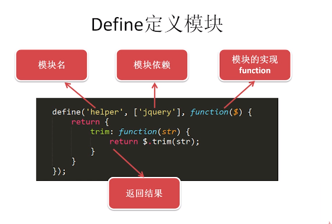
      
      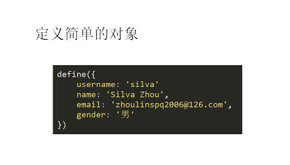
      
   * require：加载模块 
   
      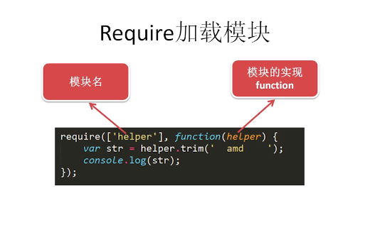
   * RequireJs使用了head.appendChild()将每一个依赖加载为一个script标签。
   
 # baseUrl&data-main区别  
   * 原始写法
   
   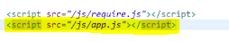
   * data-main写法
   
   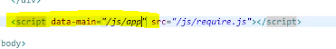
   * config方式
   
   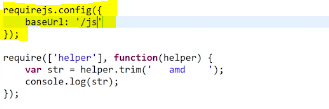
   
  # 不在baseUrl的js文件

   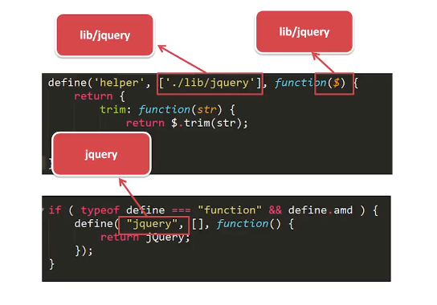
 > 解决方案：baseUrl&paths的区别，映射不放在baseUrl的模块名。
  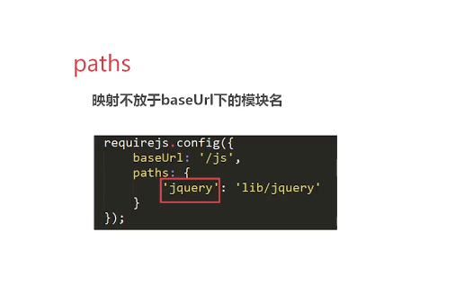 
  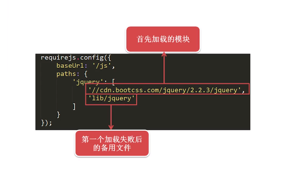
 
  # 举个例子
 > 目录
 
  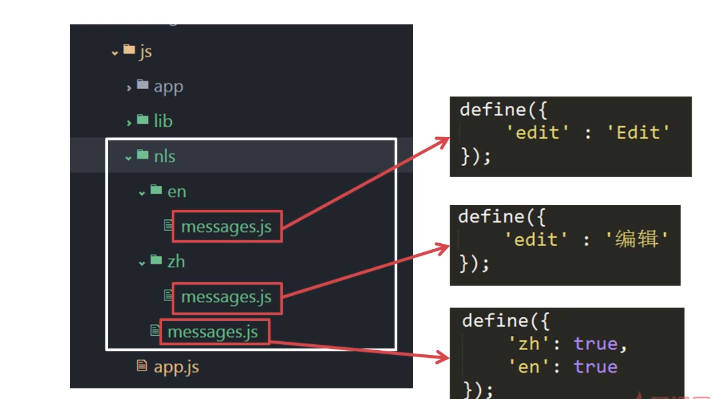 
  
 > 调用用户信息
 
   
  
   
   
   
    
   # 配置不支持AMD
   
   > eg:bootstrap
   
   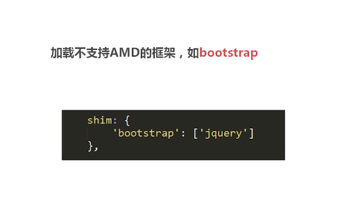 
   
   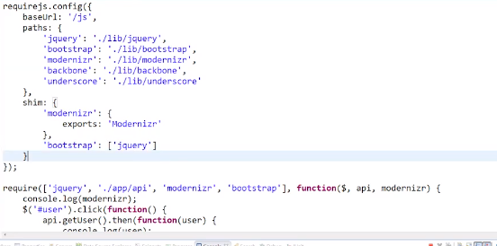 
 
  # 常用配置map
  > 当我们需要加载不同版本时可用
  
   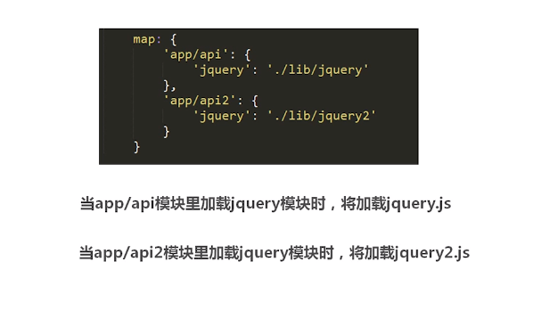 
  
  
  # jsonp服务
  
  > jsonp:是json使用的一种模式，可以跨域获得请求。
  
  > 同源（origin：就是协议，域名，端口）策略：是浏览器的一个安全功能，不同的客户端
     脚本在没有授权的情况下，不能读取对方资源。
     
  > jsonp的实现
  
  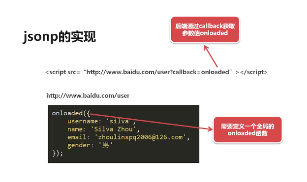 
  
  > define 定义数据
  
  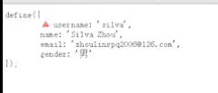 
  
  > json-ajax
  
  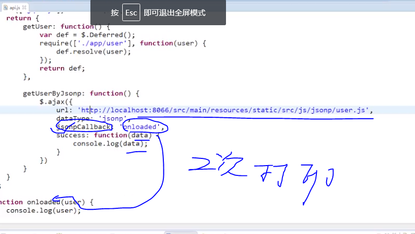 
  
  > requireJs方式
  
    
  
  
  #  text插件的使用
  
    
   
   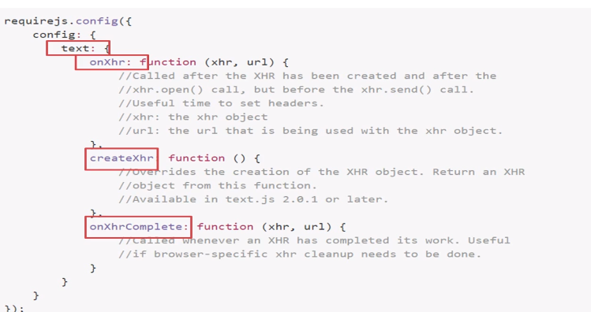
   
   
   
   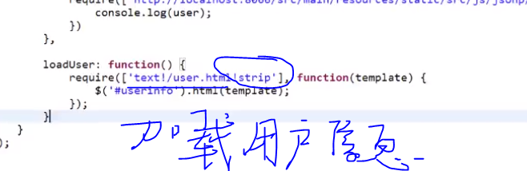
   
   # 国际化
   
   
   
   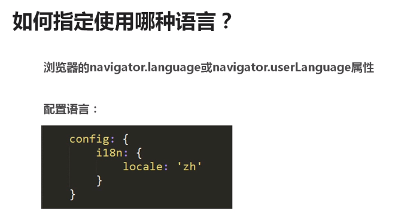
   
   
   
   
   
   
   
  