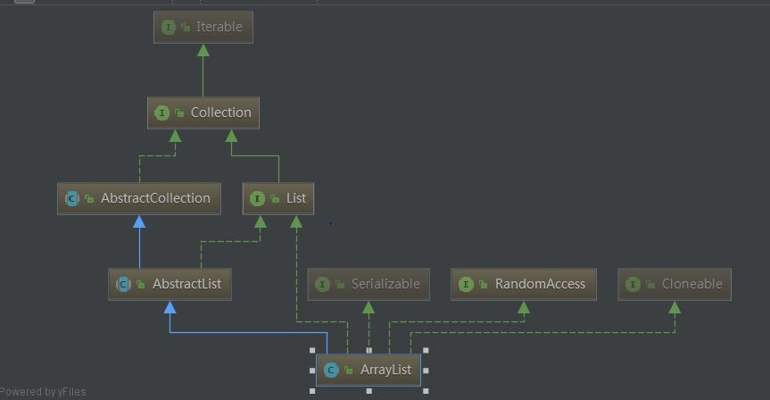

# ArrayList源码分析

 - 
   &nbsp;&nbsp;&nbsp;&nbsp;&nbsp;&nbsp;&nbsp;&nbsp;&nbsp;&nbsp;&nbsp;&nbsp;&nbsp;&nbsp;&nbsp;&nbsp;&nbsp;&nbsp;&nbsp;&nbsp;&nbsp;&nbsp;&nbsp;&nbsp;&nbsp;&nbsp;&nbsp;&nbsp;&nbsp;&nbsp; &nbsp;&nbsp;&nbsp;&nbsp;&nbsp;&nbsp;&nbsp;&nbsp;&nbsp;&nbsp;&nbsp;&nbsp; &nbsp;&nbsp;&nbsp;&nbsp;&nbsp;&nbsp;&nbsp;&nbsp;&nbsp;&nbsp;&nbsp;&nbsp; &nbsp;&nbsp;&nbsp;&nbsp;&nbsp;&nbsp;&nbsp;&nbsp;&nbsp;&nbsp;ArrayList 类图结构
    - 简单一句话概阔ArrayList:底层结构为(可动态改变大小)数组,默认容量10( private static final int DEFAULT_CAPACITY = 10;),扩充时增大到原先的1.5倍.适合频繁取值以及尾部插入或删除的场景;
    - ArrayList的一些字段
        -  ```private static final int DEFAULT_CAPACITY = 10 ：默认初始capacity```
       
        -  ```  private static final Object[] EMPTY_ELEMENTDATA = {}; ：供空的ArrayList实例使用的空的数组实例```
        
        -  ```private static final Object[] DEFAULTCAPACITY_EMPTY_ELEMENTDATA = {};：供默认大小的空的ArrayList实例使用的空的数组实例```
               
        -  ``` transient Object[] elementData;：ArrayList所包含的元素数```
      
    - ArrayList的一些方法
    
        - 构造方法
        ```
           public ArrayList() {
               this.elementData = DEFAULTCAPACITY_EMPTY_ELEMENTDATA;
            }
            * ArrayList的capacity就是这个内部数组的大小。
            * 任何elementData == DEFAULTCAPACITY_EMPTY_ELEMENTDATA的空ArrayList在第一个元素
            * 被添加进来时，其capacity都会被扩大至DEFAULT_CAPACITYhe
            
         
       ```
        - get方法
        ```public E get(int index) {
                rangeCheck(index);//index 是否超出边界
                return elementData(index);
            }
      ```
    
       - set方法  //返回的原始值
       
       ```public E set(int index, E element) {
                  rangeCheck(index);//index 是否超出边界
          
                  E oldValue = elementData(index);//先把该索引处原来的元素存储在oldValue中
                  elementData[index] = element;//附上set进来的值。
                  return oldValue;//返回的原始值
              }  
       ```         
       - add方法
       ```
         public boolean add(E e) {
                 ensureCapacityInternal(size + 1);  // Increments modCount!!,增加modCount，modCount的作用是判断在迭代时是否对ArrayList进行了结构性修改。
                 elementData[size++] = e;
                  return true;
              }
              
          public void add(int index, E element) {
                  rangeCheckForAdd(index);
          
                  ensureCapacityInternal(size + 1);  // Increments modCount!!
                  System.arraycopy(elementData, index, elementData, index + 1,
                                   size - index);
                  elementData[index] = element;
                  size++;
              }    
              
       ```
       ```
         private void ensureCapacityInternal(int minCapacity) {
               if (elementData == DEFAULTCAPACITY_EMPTY_ELEMENTDATA) {
                   minCapacity = Math.max(DEFAULT_CAPACITY, minCapacity);
               }
       
               ensureExplicitCapacity(minCapacity);
           }
       
           private void ensureExplicitCapacity(int minCapacity) {
               modCount++;
       
               // overflow-conscious code
               if (minCapacity - elementData.length > 0)
                   grow(minCapacity);
           }
           
            private void grow(int minCapacity) {
                   // overflow-conscious code
                   int oldCapacity = elementData.length;
                   int newCapacity = oldCapacity + (oldCapacity >> 1);// 每次扩容都为原先的1.5倍
                   if (newCapacity - minCapacity < 0)
                       newCapacity = minCapacity;
                   if (newCapacity - MAX_ARRAY_SIZE > 0)
                       newCapacity = hugeCapacity(minCapacity);
                   // minCapacity is usually close to size, so this is a win:
                   elementData = Arrays.copyOf(elementData, newCapacity);//  调用Arrays工具类的复制方法 
               }
         ```