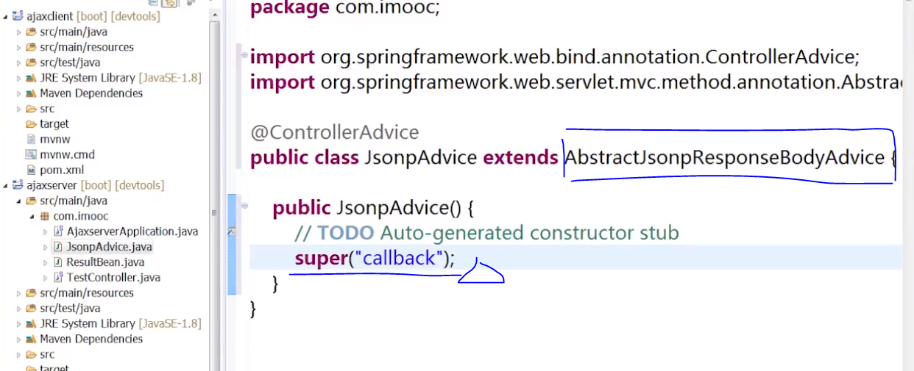
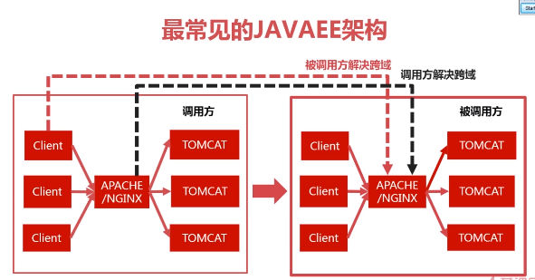

# 跨域问题

* [一、AJAX跨域的原因分析](#AJAX跨域的原因分析)
* [二、跨域问题的解决思路](#跨域问题的解决思路) 
        * [浏览器禁止检查](#浏览器禁止检查)
        * [jsonp解决跨域](#jsonp解决跨域)
        * [被调用解决-filter解决方案](#被调用解决-filter解决方案)
        * [jsonp弊端](#jsonp弊端)
        * [JAVAEE架构](#JAVAEE架构)
 
# 一、AJAX跨域的原因分析

- 为什么会发生AJAX跨域(同时满足才可能发生跨域请求)
 
   - 浏览器的限制
   - 跨域
   - XHR

# 二、跨域问题的解决思路

   - 指定参数让浏览器不做校验（客户端所有人都得改动，意义不大）。
   - 发出去的请求不是XHR类型即可，就算是跨域的，浏览器也不会报跨域安全问题。基于这种思路解决方案是 jsonp(动态创建script，发送请求)。
   - 跨域解决思路
      1. 被调用方处理：A 调用 B，设置B 允许 A域名调用。浏览器校验后就会报跨域安全问题。
      2. 调用方处理：隐藏跨域，通过代理。A 域名中的请求通过 代理转到 B。在浏览器角度上看上去就是处于同一域一样。
      
# 浏览器禁止检查(后台其实是没有限制的)
> 跨域时，日志如下：
```
   No 'Access-Control-Allow-Origin' header is present on the requested resource
   . Origin 'http://localhost:8080' is therefore not allowed access.


```
> 浏览器做如下参数配置
 ```
   chrome --disable-web-security --user-data-dir=g:\temp3

```
   
# jsonp解决跨域

> jsonp? 是json的一种补充的使用方式，不是一种官方协议，他是利用script标签，请求资源可以跨域，来解决跨域问题。

- 使用jsonp后台需要改动吗？
 ```
   $.ajax({
      url:base+"get1",
      dataType:"jsonp",
      success:function(json){
         result=json
      }
   });

```
  - 上诉请求发上语法错误
  
    - jsonp 是动态创建的一个script标签，script标签返回的是js代码，但是后台返回的还是一个json对象。
    - 后后做如下改动
 
|普通的请求  |	jsonp请求|
| :--------  | :-----    |
|  Type是xhr类型 | Type是script类型。|
|  返回时是json类型 | 返回时是js脚本|
   
 > 工作机制：上面说jsonp是一种协议，也就是说是一种规定，即当后台接受到了callback这个参数的时候，他就知道
 返回的是一个js脚本，而非json类型的数据，callback的参数值作为js返回的函数值，而返回的数据,作为
 该函数的参数（是原本所要放回的json对象）。

 
    
# jsonp弊端 

1. 只支持get方法。
2. 服务器端得改动。
3. 发送的不是XHR请求，异步&事件就用不了了。
    
    
# JAVAEE架构

 
